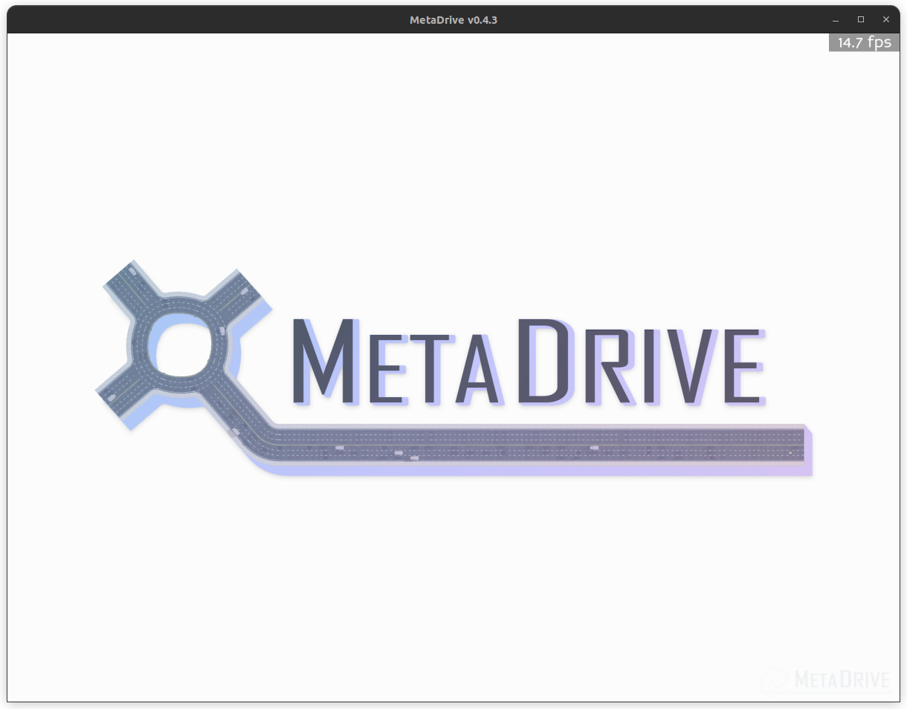

# 🚗 DriveAlign - RLHF-Based Autonomous Driving with Natural Language Feedback

> Training a vision-based autonomous driving agent using Reinforcement Learning from Human Feedback (RLHF), where humans guide the agent using natural language instead of manual reward engineering.



---

## 📌 Project Overview

DriveAlign is an end-to-end RLHF pipeline for autonomous driving inside the **MetaDrive** simulator. The agent learns to drive using a combination of:

- **Reinforcement Learning (PPO)** for base driving behavior
- **Vision (RGB Camera)** so the agent literally sees the road
- **Lidar/State sensors** for spatial awareness
- **Natural Language Feedback** from humans ("you were too aggressive in turns")
- **LLM-powered preference labeling** via local Mistral (Ollama) to convert language into structured reward signals
- **GPT-2 Small (117M)** as a learned reward model trained on human preferences
- **RLHF fine-tuning** where the agent optimizes for what the human values, not just Metadrive internal rewards

---

## 🧠 Why This Project?

Traditional RL agents optimize for hand-crafted rewards like "stay in lane" or "maintain speed." These are rigid and don't capture nuanced human preferences like smoothness, aggression level, or safety margins.

RLHF solves this by letting humans express preferences in natural language and training the agent to optimize for those preferences directly. This is the same core idea behind how large language models like GPT are aligned - applied here to physical driving behavior.

---

## 🗂️ Project Structure

```
DriveAlign-RLHF-NavCar/
│
├── rlhf_train.py                  # Phase 1 - Base RL agent (vector obs only)
├── vision_lidar_train.py          # Phase 2 - Vision + Lidar combined agent
│
├── src/
│   ├── data_recorder.py           # Phase 3 - Segment recording infrastructure
│   ├── feedback.py                # Phase 4 - LLM feedback labelling (Mistral)
│   └── reward_modeling.py         # Phase 5 - GPT-2 reward model training
│
├── data_collection.py                         # Combined Phase 3+4 live recording + feedback
├── fine_tune_with_reward_model.py # Phase 6 - RLHF fine-tuning
│
├── models/                        # Saved Phase 1 model checkpoints
│   ├── ppo_metadrive_phase1_final.zip
│   └── vecnormalize.pkl
│
├── models_vision/                 # Saved Phase 2 vision model checkpoints
│   ├── ppo_metadrive_vision_final.zip
│   └── vecnormalize.pkl
│
├── models_rlhf/                   # Saved Phase 6 RLHF fine-tuned model
│   ├── ppo_rlhf_final.zip
│   └── vecnormalize_rlhf.pkl
│
├── segments/                      # Phase 3 recorded driving segments
│   └── seg_xxxxxxxx/
│       ├── states.npy
│       ├── actions.npy
│       ├── rewards.npy
│       └── stats.json             # description + label + human feedback
│
├── reward_model/                  # Phase 5 trained GPT-2 reward model
│   ├── reward_model_best.pth
│   ├── reward_model_final.pth
│   ├── tokenizer files
│   └── training_loss.png
│
├── logs/                          # TensorBoard logs for Phase 1
├── logs_vision/                   # TensorBoard logs for Phase 2
└── logs_rlhf/                     # TensorBoard logs for Phase 6
```

---

## ⚙️ Tech Stack

| Component | Tool |
|---|---|
| Simulator | MetaDrive 0.4.3 |
| RL Algorithm | PPO (Stable-Baselines3) |
| Neural Network | PyTorch |
| Vision Encoder | Custom CNN (CNN-style) |
| Lidar Encoder | Custom MLP |
| LLM Feedback | Mistral 7B via Ollama (local) |
| Reward Model | GPT-2 Small (117M) fine-tuned on preferences |
| Logging | TensorBoard |
| Language | Python 3.11 |
| GPU | CUDA-enabled (6GB VRAM) |

---

## 🔄 Full Pipeline - Phase by Phase

### Phase 1 - Base RL Agent (Vector Observations) ✅

The first step is training a vanilla PPO agent using only sensor/lidar data - no vision. The agent receives a 259-dimensional vector containing ego state, lidar readings, and navigation info. It learns to drive using MetaDrive's built-in reward (lane following + speed).

```
Observation (259-dim vector)
        ↓
Custom MLP:
  Linear(259 → 256) → ReLU → LayerNorm
  Linear(256 → 128) → ReLU → Dropout(0.1)
  Linear(128 → 128) → ReLU
        ↓
Policy Head [64 → 64]
        ↓
Action: [steering, throttle] ∈ [-1, 1]
```

**Goal:** Agent reliably reaches the destination without crashing on varied track layouts.

---

### Phase 2 - Vision + Lidar Agent ✅

The observation is upgraded to include a live RGB camera feed alongside the lidar state vector. A combined CNN + MLP architecture processes both streams in parallel and merges them before the policy head.

```
┌─────────────────────────────┐   ┌──────────────────┐
│  Camera Frame (84×84×3)     │   │  State (19-dim)   │
│  squeeze stack dim          │   │  lidar + ego +    │
│  permute → (3, 84, 84)      │   │  navigation       │
│                             │   └────────┬─────────┘
│  Conv2d(3→32, 8×8, s=4)    │            │
│  Conv2d(32→64, 4×4, s=2)   │   Linear(19 → 128) → ReLU
│  Conv2d(64→64, 3×3, s=1)   │   LayerNorm(128)
│  Flatten → Linear → 128-dim│   Linear(128 → 64) → ReLU
└─────────────┬───────────────┘            │
              │                            │
              └──────────┬─────────────────┘
                         │
                   Concat (192-dim)
                         │
                 Linear(192 → 128) → ReLU
                 Linear(128 → 64)  → ReLU
                    ┌────┴────┐
                    │         │
               Actor Head  Critic Head
               (steer,      (value
               throttle)    estimate)
```

**Policy:** `MultiInputPolicy` (handles dict observation spaces natively in SB3)

**Training config:**
- 8 parallel envs via SubprocVecEnv
- n_steps=512 per env → 4096 total samples per update
- batch_size=256, learning_rate=3e-4

---

### Phase 3 - Segment Recording ✅

The trained agent drives while a `SegmentRecorder` captures 50 & 100-step chunks (~5-10 seconds each). Each segment stores:

```
segments/seg_xxxxxxxx/
    states.npy     ← lidar/state vectors at each step
    actions.npy    ← steering + throttle at each step
    rewards.npy    ← MetaDrive reward at each step
    stats.json     ← summary stats + auto-generated description
```

The `stats.json` auto-generates a plain English description of each segment:

```json
{
  "description": "The agent drove at good speed (avg 8.2 m/s) with slight lane deviation. Steering was mostly smooth. No incidents. Total reward: 45.2.",
  "label": ...,
  "human_feedback": ...
}
```

These segments are what the LLM will later review and label in Phase 4.

---

### Phase 4 - LLM Feedback Layer ✅

**Key design decision:** Phase 3 and Phase 4 run together in `data_collection.py`. The agent drives live in a render window while the human watches. After each segment the terminal prints what just happened and asks for feedback:

```
📊 SEGMENT SUMMARY - What just happened:
  Speed          : avg 8.2 m/s  |  max 10.1 m/s
  Lane deviation : avg 0.15m    |  max 0.42m
  Steering smooth: 0.120
  Total reward   : 45.20
  Crashed        : No
  Out of road    : No

  Description:
  "The agent drove at good speed with slight lane deviation..."

Your feedback: "too aggressive in the turns"
```

Mistral (running locally via Ollama) reads the segment description + human feedback and labels it:

```json
{
  "label": "bad",
  "confidence": 0.95,
  "llm_reason": "Agent showed erratic steering in turns",
  "human_feedback": "too aggressive in the turns"
}
```

This is the novel contribution - replacing manual click-based preferences with natural language understanding. All three stored per segment: human text, Mistral label, confidence score.

**Why local Mistral?** No API costs, no rate limits, runs fully offline.

---

### Phase 5 - Reward Model Training ✅

**Architecture decision:** GPT-2 Small (117M) used as a text encoder - not a text generator. It reads the segment description and outputs a single scalar score.

```
Input text:
  "Driving behaviour: agent drove at 8.2 m/s, slight lane deviation...
   Human feedback: too aggressive in turns"
        ↓
GPT-2 Small (117M) - last token hidden state (768-dim)
        ↓
score_head:
  Linear(768 → 256) → ReLU → Dropout(0.1)
  Linear(256 → 64)  → ReLU
  Linear(64 → 1)    → Sigmoid
        ↓
Score: 0.0 (bad driving) → 1.0 (good driving)
```

**Training target:**
```
good segment + confidence 0.95 → target score = 0.95
bad  segment + confidence 0.95 → target score = 0.05
```

**Training results (100 labelled segments, 34 good / 66 bad):**
```
Epoch 1  → Train loss: 0.20   Val loss: 0.17
Epoch 9  → sharp drop (model clicks)
Epoch 20 → Train loss: 0.039  Val loss: 0.033  ← no overfitting

Test inference:
  Good driving description → score: 0.791 ✅
  Bad driving description  → score: 0.057 ✅
```

---

### Phase 6 - RLHF Fine-Tuning ✅

The Phase 2 vision agent is fine-tuned using PPO with a **combined reward signal**:

```
combined_reward = 0.4 × MetaDrive_reward + 0.6 × GPT2_score
```

**How GPT-2 integrates with PPO:**
```
Steps 1-99   → accumulate stats, MetaDrive reward only
Step 100     → build description from accumulated stats
              → query GPT-2 reward model (CPU)
              → get score (e.g. 0.79)
              → spread as per-step bonus: 0.79 / 100 = 0.0079/step
Steps 101+   → next segment begins
```

**CUDA architecture:** Reward model runs on CPU inside each subprocess. GPU stays fully reserved for PPO. Reward model is created inside each subprocess to avoid CUDA fork errors.

**Randomised environments for generalisation:**
```python
"map": 7,             # random 7-block layout every episode (was fixed "SCSCSCS")
"num_scenarios": 500, # 500 unique scenarios (was 20)
"start_seed": rank * 100  # each env gets unique seed range
```

```
env_0 → seeds   0-100, random maps
env_1 → seeds 100-200, random maps
env_2 → seeds 200-300, random maps
env_3 → seeds 300-400, random maps
= 400 unique road layouts, agent must generalise
```

**Fine-tuning hyperparameters:**

| Parameter | Phase 2 | Phase 6 |
|---|---|---|
| Learning rate | 3e-4 | 1e-4 |
| Clip range | 0.2 | 0.1 |
| Entropy coef | 0.01 | 0.005 |
| Start weights | random | Phase 2 model |
| Reward | MetaDrive only | MetaDrive + GPT-2 |
| Map | fixed SCSCSCS | random 7-block |
| Scenarios | 20 | 500 |
| Parallel envs | 4 | 2 |

---

### Phase 7 - Metrics + Visualization (upcoming)

Before vs after RLHF comparison using three key metrics:

| Metric | Before RLHF | After RLHF |
|---|---|---|
| Lane Deviation | Higher | Lower ↓ |
| Crash Rate | Higher | Lower ↓ |
| Smoothness (jerk) | Worse | Better ↑ |
| Route Completion | Partial | Higher ↑ |

TensorBoard plots show these trends over training timesteps, providing visual proof of improvement from human feedback.

---

## 🚀 Getting Started

### 1. Clone and set up environment

```bash
git clone <your-repo-url>
cd DriveAlign-RLHF-NavCar

python3 -m venv metadrive-env
source metadrive-env/bin/activate

pip install --upgrade pip
pip install metadrive-simulator stable-baselines3 tensorboard gymnasium \
            torch torchvision transformers scikit-learn matplotlib requests
```

### 2. Set up Mistral locally (required for Phase 4)

```bash
curl -fsSL https://ollama.com/install.sh | sh
ollama pull mistral
ollama serve
```

### 3. Run Phase 1 (Base Agent)

```bash
# Train
python rlhf_train.py

# Evaluate
python rlhf_train.py eval

# Monitor
tensorboard --logdir ./logs/
```

### 4. Run Phase 2 (Vision + Lidar)

```bash
# Inspect observations first
python vision_lidar_train.py inspect

# Train
python vision_lidar_train.py

# Evaluate
python vision_lidar_train.py eval

# Monitor
tensorboard --logdir ./logs_vision/
```

### 5. Run Phase 3 + 4 (Live Recording + Feedback)

```bash
# Watch agent drive live + give feedback after each segment
python data_collection.py

# Review all labelled segments after
python src/feedback.py review
```

### 6. Run Phase 5 (Reward Model Training)

```bash
# Train GPT-2 reward model
python src/reward_modeling.py

# Test inference after training
python src/reward_modeling.py test
```

### 7. Run Phase 6 (RLHF Fine-tuning)

```bash
# Fine-tune with human-aligned reward
python fine_tune_with_reward_model.py

# Evaluate
python fine_tune_with_reward_model.py eval

# Monitor
tensorboard --logdir ./logs_rlhf/
watch -n 1 nvidia-smi
```

---

## 🌍 Environment Configuration

| Config Key | Phase 1-5 | Phase 6 |
|---|---|---|
| `map` | `SCSCSCS` (fixed) | `7` (random 7-block) |
| `num_scenarios` | 20 | 500 |
| `start_seed` | default | `rank × 100` per env |
| `traffic_density` | 0.2 | 0.2 |
| `accident_prob` | 0.2 | 0.2 |
| `random_lane_width` | True | True |
| `image_observation` | True | True |
| `stack_size` | 1 | 1 |
| `norm_pixel` | True | True |

---

## 📈 Training Hyperparameters

| Parameter | Phase 2 | Phase 6 | Reason |
|---|---|---|---|
| Algorithm | PPO | PPO | Stable, sample efficient for continuous control |
| Learning Rate | 3e-4 | 1e-4 | Lower LR for fine-tuning stability |
| n_steps | 512 | 512 | Per env rollout buffer |
| batch_size | 256 | 256 | Larger minibatch for GPU utilisation |
| n_epochs | 10 | 10 | PPO update epochs per rollout |
| gamma | 0.99 | 0.99 | Long-horizon discount |
| gae_lambda | 0.95 | 0.95 | Advantage estimation smoothing |
| clip_range | 0.2 | 0.1 | Tighter clip for fine-tuning |
| ent_coef | 0.01 | 0.005 | Lower entropy, less exploration needed |
| Parallel envs | 8 | 4 | 4 for Phase 6 to fit reward model in memory |

---

## 📊 What Good Training Looks Like

In TensorBoard watch for:

- `train/std` → should steadily **decrease** (agent gaining confidence)
- `train/policy_gradient_loss` → should stay **negative** (policy improving)
- `ep_rew_mean` → should steadily **increase** over timesteps
- `ep_len_mean` → should **increase** (surviving longer before crashing)
- `explained_variance` → should stay **above 0.8** (good value estimation)
- `value_loss` → should **decrease** over time

For Phase 5 reward model:
- Val loss should track train loss closely (no overfitting)
- Test: good driving should score 0.7+ and bad should score below 0.2

---

## 🔮 Roadmap

- [x] Phase 1 - Base RL Agent (vector obs)
- [x] Phase 2 - Vision + Lidar Agent
- [x] Phase 3 - Segment recording infrastructure
- [x] Phase 4 - LLM feedback layer (local Mistral via Ollama)
- [x] Phase 5 - GPT-2 reward model training
- [x] Phase 6 - RLHF fine-tuning with combined reward
- [ ] Phase 7 - Metrics dashboard + before/after comparison

---

## 👤 Author

Built as a research project demonstrating RLHF applied to autonomous driving - combining computer vision, reinforcement learning, and large language models in a unified pipeline.
