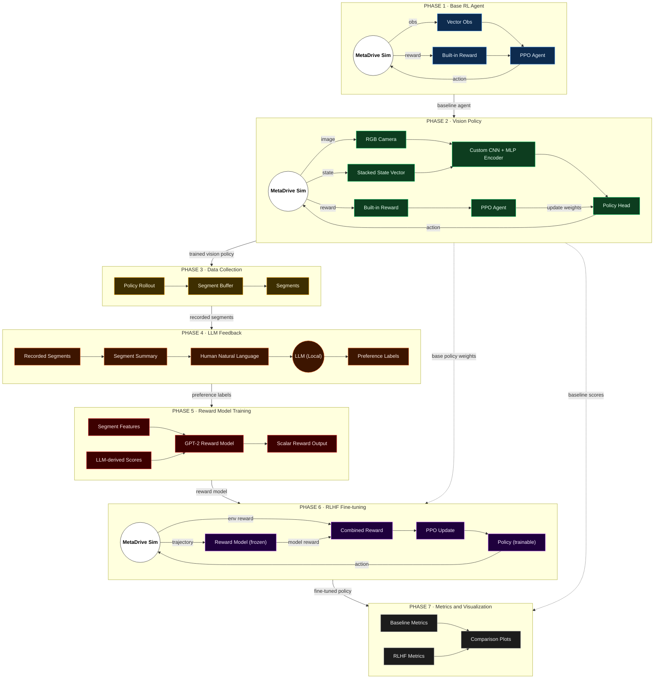

# 🚗 DriveAlign - RLHF for Autonomous Driving with Natural Language Feedback

> Teaching a car to drive the way *you* want it to - not the way an engineer hardcoded it to.


---

## 📌 What is this?

DriveAlign is a full RLHF pipeline built inside the **MetaDrive** simulator. The agent starts by learning to drive on its own using standard RL, then gets refined based on how a human *describes* its driving in plain English - things like *"too aggressive in the turns"* or *"it was driving fine but braked too hard."*

That natural language gets parsed by a local LLM (Mistral via Ollama), which converts it into structured preference labels. Those labels train a reward model (GPT-2 Small), which then replaces MetaDrive's built-in reward during fine-tuning. The result is an agent that optimizes for what the human actually wanted - not what someone tried to approximate with a hand-crafted formula.

The full stack:
- **PPO (Stable-Baselines3)** for reinforcement learning
- **RGB Camera + Lidar** so the agent sees and senses the road
- **Mistral 7B via Ollama** - local LLM, no API costs, fully offline
- **GPT-2 Small (117M)** as the reward model, reading driving descriptions and outputting a score
- **Combined reward** (MetaDrive + GPT-2 score) during RLHF fine-tuning

---

## 🧠 Why build this?

Standard RL for driving works like this: define a reward function. Stay in lane? +1. Crash? -10. Speed between 5–10 m/s? +0.5. And so on. The problem is that no reward function you write actually captures what good driving *feels* like. You end up with an agent that technically stays in lane but drives like it's having a mild seizure - jerky, weird, technically correct, completely unnatural.

RLHF is how modern AI systems like ChatGPT get trained to be helpful rather than just grammatically correct. The same idea applies here: instead of asking a human to click "this segment scores 0.67," you just let them say what they noticed - *"the car was too aggressive in the turn"* - and let the LLM do the hard work of converting that into something the reward model can train on.

That's the core idea. Humans are bad at assigning numbers. They're good at describing things. This project bridges that gap.

---

## 🗺️ Architecture - All 7 Phases



---

## 🗂️ Project Structure

```
DriveAlign-RLHF-NavCar/
│
├── rlhf_train.py                  # Phase 1 - Base RL agent (vector obs only)
├── vision_lidar_train.py          # Phase 2 - Vision + Lidar combined agent
│
├── src/
│   ├── data_recorder.py           # Phase 3 - Segment recording infrastructure
│   ├── feedback.py                # Phase 4 - LLM feedback labelling (Mistral)
│   └── reward_modeling.py         # Phase 5 - GPT-2 reward model training
│
├── data_collection.py             # Combined Phase 3+4 live recording + feedback
├── fine_tune_with_reward_model.py # Phase 6 - RLHF fine-tuning
│
├── models/                        # Phase 1 checkpoints
│   ├── ppo_metadrive_phase1_final.zip
│   └── vecnormalize.pkl
│
├── models_vision/                 # Phase 2 vision model checkpoints
│   ├── ppo_metadrive_vision_final.zip
│   └── vecnormalize.pkl
│
├── models_rlhf/                   # Phase 6 RLHF fine-tuned model
│   ├── ppo_rlhf_final.zip
│   └── vecnormalize_rlhf.pkl
│
├── segments/                      # Phase 3 recorded driving segments
│   └── seg_xxxxxxxx/
│       ├── states.npy
│       ├── actions.npy
│       ├── rewards.npy
│       └── stats.json             # description + LLM label + human feedback
│
├── reward_model/                  # Phase 5 trained GPT-2 reward model
│   ├── reward_model_best.pth
│   ├── reward_model_final.pth
│   ├── tokenizer files
│   └── training_loss.png
│
├── logs/                          # TensorBoard logs - Phase 1
├── logs_vision/                   # TensorBoard logs - Phase 2
└── logs_rlhf/                     # TensorBoard logs - Phase 6
```

---

## ⚙️ Tech Stack

| Component | Tool |
|---|---|
| Simulator | MetaDrive 0.4.3 |
| RL Algorithm | PPO (Stable-Baselines3) |
| Neural Network | PyTorch |
| Vision Encoder | Custom CNN (3-layer Conv2d) |
| State Encoder | Custom MLP |
| LLM Feedback | Mistral 7B via Ollama (local, offline) |
| Reward Model | GPT-2 Small (117M) fine-tuned on preferences |
| Logging | TensorBoard |
| Language | Python 3.11 |
| GPU | CUDA-enabled (6GB VRAM) |

---

## 🔄 Pipeline - Phase by Phase

### Phase 1 - Base RL Agent (Vector Observations) ✅

The starting point. A vanilla PPO agent trained on only sensor/lidar data - no camera, no vision. It receives a 259-dimensional vector (ego state + lidar + navigation) and learns to drive using MetaDrive's built-in reward.

```
Observation (259-dim vector)
        ↓
Custom MLP:
  Linear(259 → 256) → ReLU → LayerNorm
  Linear(256 → 128) → ReLU → Dropout(0.1)
  Linear(128 → 128) → ReLU
        ↓
Policy Head [64 → 64]
        ↓
Action: [steering, throttle] ∈ [-1, 1]
```

**Goal:** Agent reliably reaches the destination without crashing on varied track layouts.

---

### Phase 2 - Vision + Lidar Agent ✅

The observation is upgraded to include a live RGB camera feed alongside the lidar state vector. A custom CNN processes the image stream and a separate MLP handles the state vector. Both are merged before the policy head.

```
┌─────────────────────────────┐   ┌──────────────────┐
│  Camera Frame (84×84×3)     │   │  State (19-dim)   │
│  squeeze stack dim          │   │  lidar + ego +    │
│  permute → (3, 84, 84)      │   │  navigation       │
│                             │   └────────┬─────────┘
│  Conv2d(3→32, 8×8, s=4)    │            │
│  Conv2d(32→64, 4×4, s=2)   │   Linear(19 → 128) → ReLU
│  Conv2d(64→64, 3×3, s=1)   │   LayerNorm(128)
│  Flatten → Linear → 128-dim│   Linear(128 → 64) → ReLU
└─────────────┬───────────────┘            │
              └──────────┬─────────────────┘
                         │
                   Concat (192-dim)
                         │
                 Linear(192 → 128) → ReLU
                 Linear(128 → 64)  → ReLU
                    ┌────┴────┐
                    │         │
               Actor Head  Critic Head
               (steer,      (value
               throttle)    estimate)
```

**Policy:** `MultiInputPolicy` - handles dict observation spaces natively in SB3.

**Training config:** 8 parallel envs via SubprocVecEnv, n_steps=512 per env → 4096 total samples per update, batch_size=256, learning_rate=3e-4.

---

### Phase 3 - Segment Recording ✅

The trained vision agent drives while a `SegmentRecorder` captures 50 and 100-step chunks (~5–10 seconds each). Each segment stores:

```
segments/seg_xxxxxxxx/
    states.npy     ← lidar/state vectors at each step
    actions.npy    ← steering + throttle at each step
    rewards.npy    ← MetaDrive reward at each step
    stats.json     ← summary stats + auto-generated description
```

The `stats.json` auto-generates a plain English description of the segment:

```json
{
  "description": "The agent drove at good speed (avg 8.2 m/s) with slight lane deviation. Steering was mostly smooth. No incidents. Total reward: 45.2.",
  "label": null,
  "human_feedback": null
}
```

These segments are what the LLM reviews and labels in Phase 4.

---

### Phase 4 - LLM Feedback Layer ✅

This is the novel part of the project. Phase 3 and Phase 4 run together in `data_collection.py`. The agent drives live in a render window while the human watches. After each segment, the terminal prints a summary and asks for feedback:

```
📊 SEGMENT SUMMARY - What just happened:
  Speed          : avg 8.2 m/s  |  max 10.1 m/s
  Lane deviation : avg 0.15m    |  max 0.42m
  Steering smooth: 0.120
  Total reward   : 45.20
  Crashed        : No
  Out of road    : No

  Description:
  "The agent drove at good speed with slight lane deviation..."

Your feedback: "too aggressive in the turns"
```

Mistral (running locally via Ollama) reads the segment description + human feedback and produces a structured label:

```json
{
  "label": "bad",
  "confidence": 0.95,
  "llm_reason": "Agent showed erratic steering in turns",
  "human_feedback": "too aggressive in the turns"
}
```

The key design choice here: the human never assigns a number. They just describe what they saw. The LLM does the work of interpreting that into a structured signal. This is what separates the project from standard RLHF with click-based comparisons.

**Why local Mistral?** No API costs, no rate limits, runs fully offline.

---

### Phase 5 - Reward Model Training ✅

GPT-2 Small (117M) is used as a text encoder - not a text generator. It reads the segment description + human feedback and outputs a single scalar score between 0 and 1.

```
Input text:
  "Driving behaviour: agent drove at 8.2 m/s, slight lane deviation...
   Human feedback: too aggressive in turns"
        ↓
GPT-2 Small (117M) - last token hidden state (768-dim)
        ↓
score_head:
  Linear(768 → 256) → ReLU → Dropout(0.1)
  Linear(256 → 64)  → ReLU
  Linear(64 → 1)    → Sigmoid
        ↓
Score: 0.0 (bad driving) → 1.0 (good driving)
```

**Training target:**
```
good segment + confidence 0.95 → target score = 0.95
bad  segment + confidence 0.95 → target score = 0.05
```

**Training results (100 labelled segments - 34 good / 66 bad):**
```
Epoch 1  → Train loss: 0.20   Val loss: 0.17
Epoch 9  → sharp drop (model clicks)
Epoch 20 → Train loss: 0.039  Val loss: 0.033  ← no overfitting

Test inference:
  Good driving description → score: 0.791 ✅
  Bad driving description  → score: 0.057 ✅
```

---

### Phase 6 - RLHF Fine-tuning ✅

The Phase 2 vision agent is fine-tuned using PPO with a **combined reward signal**:

```
combined_reward = 0.4 × MetaDrive_reward + 0.6 × GPT2_score
```

**How GPT-2 integrates with PPO:**
```
Steps 1–99   → accumulate stats, MetaDrive reward only
Step 100     → build description from accumulated stats
             → query GPT-2 reward model (CPU)
             → get score (e.g. 0.79)
             → spread as per-step bonus: 0.79 / 100 = 0.0079/step
Steps 101+   → next segment begins
```

**CUDA note:** The reward model runs on CPU inside each subprocess. The GPU stays fully reserved for PPO. The reward model is instantiated inside each subprocess to avoid CUDA fork errors.

**Randomised environments for generalisation:**
```python
"map": 7,             # random 7-block layout every episode
"num_scenarios": 500, # 500 unique scenarios (was 20)
"start_seed": rank * 100  # each env gets a unique seed range
```

```
env_0 → seeds   0–100, random maps
env_1 → seeds 100–200, random maps
env_2 → seeds 200–300, random maps
env_3 → seeds 300–400, random maps
= 400 unique road layouts, agent must generalise
```

**Fine-tuning hyperparameters:**

| Parameter | Phase 2 | Phase 6 |
|---|---|---|
| Learning rate | 3e-4 | 1e-4 |
| Clip range | 0.2 | 0.1 |
| Entropy coef | 0.01 | 0.005 |
| Start weights | random init | Phase 2 model |
| Reward | MetaDrive only | MetaDrive + GPT-2 |
| Map | fixed SCSCSCS | random 7-block |
| Scenarios | 20 | 500 |
| Parallel envs | 8 | 4 |

---

### Phase 7 - Metrics + Visualization (in progress)

Before vs after RLHF comparison across four key metrics:

| Metric | Before RLHF | After RLHF |
|---|---|---|
| Lane Deviation | Higher | Lower ↓ |
| Crash Rate | Higher | Lower ↓ |
| Smoothness (jerk) | Worse | Better ↑ |
| Route Completion | Partial | Higher ↑ |

TensorBoard plots show these trends over training timesteps - visual proof that human language feedback actually changed how the agent drives.

---

## 🚀 Getting Started

### 1. Clone and set up environment

```bash
git clone <your-repo-url>
cd DriveAlign-RLHF-NavCar

python3 -m venv metadrive-env
source metadrive-env/bin/activate

pip install --upgrade pip
pip install metadrive-simulator stable-baselines3 tensorboard gymnasium \
            torch torchvision transformers scikit-learn matplotlib requests
```

### 2. Set up Mistral locally (required for Phase 4)

```bash
curl -fsSL https://ollama.com/install.sh | sh
ollama pull mistral
ollama serve
```

### 3. Phase 1 - Base Agent

```bash
python rlhf_train.py          # train
python rlhf_train.py eval     # evaluate
tensorboard --logdir ./logs/
```

### 4. Phase 2 - Vision + Lidar

```bash
python vision_lidar_train.py inspect   # inspect observations first
python vision_lidar_train.py           # train
python vision_lidar_train.py eval      # evaluate
tensorboard --logdir ./logs_vision/
```

### 5. Phase 3 + 4 - Live Recording + Feedback

```bash
python data_collection.py          # watch agent drive live, give feedback after each segment
python src/feedback.py review      # review all labelled segments
```

### 6. Phase 5 - Reward Model Training

```bash
python src/reward_modeling.py       # train GPT-2 reward model
python src/reward_modeling.py test  # test inference after training
```

### 7. Phase 6 - RLHF Fine-tuning

```bash
python fine_tune_with_reward_model.py       # fine-tune
python fine_tune_with_reward_model.py eval  # evaluate
tensorboard --logdir ./logs_rlhf/
watch -n 1 nvidia-smi
```

---

## 🌍 Environment Configuration

| Config Key | Phase 1–5 | Phase 6 |
|---|---|---|
| `map` | `SCSCSCS` (fixed) | `7` (random 7-block) |
| `num_scenarios` | 20 | 500 |
| `start_seed` | default | `rank × 100` per env |
| `traffic_density` | 0.2 | 0.2 |
| `accident_prob` | 0.2 | 0.2 |
| `random_lane_width` | True | True |
| `image_observation` | True | True |
| `stack_size` | 1 | 1 |
| `norm_pixel` | True | True |

---

## 📈 Training Hyperparameters

| Parameter | Phase 2 | Phase 6 | Reason |
|---|---|---|---|
| Algorithm | PPO | PPO | Stable, sample efficient for continuous control |
| Learning Rate | 3e-4 | 1e-4 | Lower LR for fine-tuning stability |
| n_steps | 512 | 512 | Per env rollout buffer |
| batch_size | 256 | 256 | Larger minibatch for GPU utilisation |
| n_epochs | 10 | 10 | PPO update epochs per rollout |
| gamma | 0.99 | 0.99 | Long-horizon discount |
| gae_lambda | 0.95 | 0.95 | Advantage estimation smoothing |
| clip_range | 0.2 | 0.1 | Tighter clip for fine-tuning |
| ent_coef | 0.01 | 0.005 | Less exploration needed during fine-tuning |
| Parallel envs | 8 | 4 | Reduced to fit reward model in memory |

---

## 📊 What Good Training Looks Like

In TensorBoard, watch for:

- `train/std` → should steadily **decrease** (agent gaining confidence)
- `train/policy_gradient_loss` → should stay **negative** (policy improving)
- `ep_rew_mean` → should steadily **increase** over timesteps
- `ep_len_mean` → should **increase** (surviving longer before crashing)
- `explained_variance` → should stay **above 0.8** (value estimation is healthy)
- `value_loss` → should **decrease** over time

For the Phase 5 reward model:
- Val loss should closely track train loss - if it diverges, you're overfitting
- Good driving descriptions should score 0.7+, bad ones should score below 0.2

---

## ✅ Roadmap

- [x] Phase 1 - Base RL agent (vector obs)
- [x] Phase 2 - Vision + Lidar agent
- [x] Phase 3 - Segment recording infrastructure
- [x] Phase 4 - LLM feedback layer (local Mistral via Ollama)
- [x] Phase 5 - GPT-2 reward model training
- [x] Phase 6 - RLHF fine-tuning with combined reward
- [ ] Phase 7 - Metrics dashboard + before/after comparison

---

## 👤 Author

Built as a research project exploring how RLHF can be applied to physical driving behaviour - connecting computer vision, reinforcement learning, and language models in a single end-to-end pipeline.